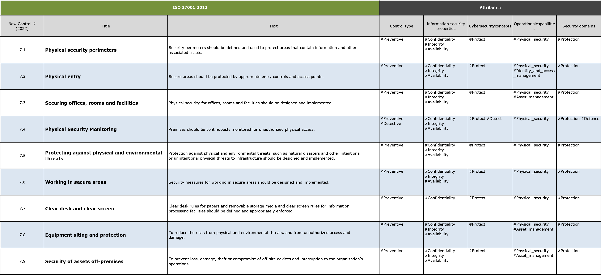
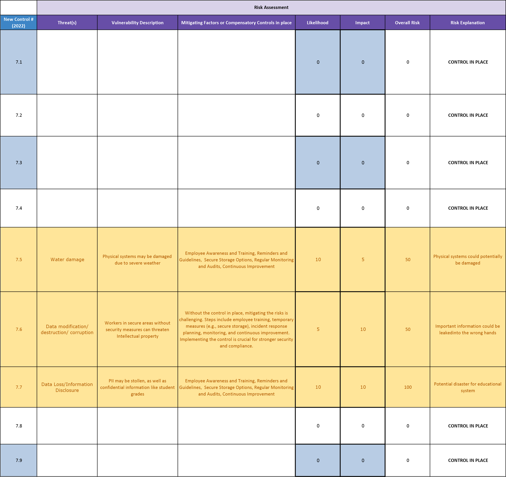

# ISO 27001 Compliance Audit and Risk Assessment

## Compliance Audit 
#### ISO 27001: 2013 | Physical Controls Catalog:

### Zoom Interview of IT Manager
  
| Control Identifier | Question  | Response  |
| ------------- | ------------- | ------------- |
| 7.1 | Are we compliant with the control that states security perimeters should be defined and used to protect areas containing information and associated assets?  | Locate desktops in an access-controlled environment. Keep laptops with you at all times or stored in a secured location. Locate servers in an access-controlled environment and limit physical access. Log physical access for Sensitive systems. |
| 7.2 | Is the IT department compliant with the control to protect secure areas through appropriate entry controls and access points? | We have a strict visitor management process in place. Visitors are required to sign in, provide identification, and receive a visitor badge before entering any secure areas. They are escorted by authorized personnel throughout their visit. |
| 7.3 | Is the IT department compliant with the control to design and implement physical security measures for offices, rooms, and facilities?  | We have implemented a comprehensive access control system that includes measures such as card readers, biometric scanners, or keypads to restrict entry into secure areas. Only authorized personnel are granted access through these controlled entry points. |
| 7.4 | Is the IT department compliant with the control to continuously monitor premises for unauthorized physical access? | Duke University deploys cameras (closed circuit and network cameras) to meet operational, physical security or public safety requirements. |
| 7.5 | Is the IT department compliant with the control to design and implement protection against physical and environmental threats to infrastructure" | Our university nas implemented pnysical security measures, tire protection systems, uninterruptible power supply, and redundant infrastructure to address physical and environmental threats. However, we are working on improving our preparedness for natural disasters, enhancing physical infrastructure protection, and conducting more trequent testing and reviews. |
| 7.6 |  Is the IT department compliant with the control to design and implement security measures for working in secure areas. | Our university is currently not fully compliant with the control for security measures in secure areas. We are actively working on implementing standardized security measures, including risk assessments, policies and procedures, access controls, security awareness training, and regular audits. |
| 7.7 | Are clear desk rules for papers and removable storage media, as well as clear screen rules for information processing facilities, defined and appropriately enforced by the IT department? | At present, there is no specific policy or guideline in place that mandates employees to adhere to clear desk rules  |
| 7.8 | Is the IT department taking measures to reduce risks from physical and environmental threats, as well as unauthorized access and damage?  | The IT department has implemented security measures to protect against threats, unauthorized access, and damage. Regular audits, incident response plans, and employee training enhance overall security.  |
| 7.9 |  Is the IT department implementing measures to prevent loss, damage, theft, or compromise of off-site devices and to avoid interruptions to the organization's operations? | The IT department keeps off-site devices safe by using strong passwords, encrypting data, erasing information if a device is lost, and teaching employees about security. This helps avoid problems and keeps devices secure when they re not at the once. |

#### Compliance Audit - Results:

## Risk Assessment

#### Risk Assessment - Results:

#### Risk Values:
##### The table below calculates the quantifiable risk based on determined likelihood and impact.

#### Threat Likelihood Values:

#### Threat Impact Values:

